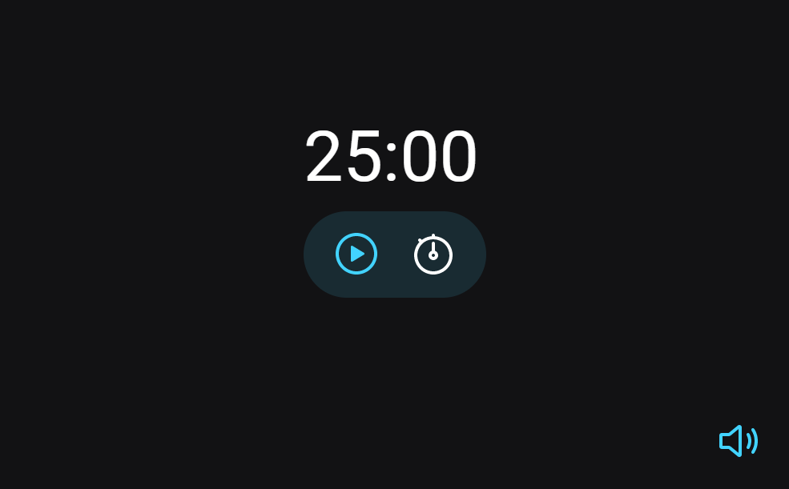

# Lofi Timer

> Projeto construído na aula do Explorer turma 3.0 da Rocketseat.

Timer com música lofi de fundo para estudos e concentração.

[🔗 Clique aqui para acessar](https://rildojunior.github.io/lofi-timer/)

## 🛠️ Tecnologias

- HTML
- CSS
- Javascript
- Git e Github

## ✉️ Contato

rildojuniorcontato@gmail.com
